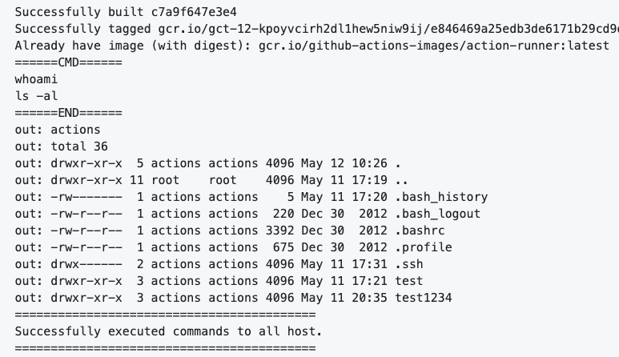

# 🚀 SSH for GitHub Actions

[GitHub Action](https://developer.github.com/actions/) for executing remote ssh commands.


## Usage

Executing remote ssh commands.

```
action "Executing remote ssh commands" {
  uses = "appleboy/ssh-action@master"
  secrets = [
    "HOST",
    "PASSWORD",
  ]
  args = [
    "--user", "actions",
    "--script", "whoami",
  ]
}
```

## Environment variables

* HOST - ssh server host
* PORT - ssh server port
* USERNAME - ssh server username
* PASSWORD - ssh server password
* KEY - ssh server private key
* SCRIPT - execute the scripts

### Example

Executing remote ssh commands.

```
action "Executing remote ssh commands" {
  uses = "appleboy/ssh-action@master"
  secrets = [
    "PASSWORD",
  ]
  args = [
    "--host", "foo.com"
    "--user", "bar",
    "--script", "whoami",
  ]
}
```

Using private key

```
action "Support Private Key" {
  uses = "appleboy/ssh-action@master"
  secrets = [
    "HOST",
    "KEY",
  ]
  args = [
    "--user", "actions",
    "--script", "'ls -al'",
  ]
}
```

Multiple Commands

```
action "Multiple Commands" {
  uses = "appleboy/ssh-action@master"
  secrets = [
    "HOST",
    "KEY",
  ]
  args = [
    "--user", "actions",
    "--script", "'whoami'",
    "--script", "'ls -al'",
  ]
}
```



Multiple Hosts

```
action "Multiple Hosts" {
  uses = "appleboy/ssh-action@master"
  secrets = [
    "KEY",
  ]
  args = [
    "--host", "foo.com",
    "--host", "bar.com",
    "--user", "actions",
    "--script", "'whoami'",
    "--script", "'ls -al'",
    "--script", "'cat test.txt'",
  ]
}
```

see the detail of `drone-ssh` command

```
   --ssh-key value                           private ssh key [$PLUGIN_SSH_KEY, $PLUGIN_KEY, $SSH_KEY, $KEY]
   --key-path value, -i value                ssh private key path [$PLUGIN_KEY_PATH, $SSH_KEY_PATH, $PATH]
   --username value, --user value, -u value  connect as user (default: "root") [$PLUGIN_USERNAME, $PLUGIN_USER, $SSH_USERNAME, $USERNAME]
   --password value, -P value                user password [$PLUGIN_PASSWORD, $SSH_PASSWORD, $PASSWORD]
   --host value, -H value                    connect to host [$PLUGIN_HOST, $SSH_HOST, $HOST]
   --port value, -p value                    connect to port (default: 22) [$PLUGIN_PORT, $SSH_PORT, $PORT]
   --sync                                    sync mode [$PLUGIN_SYNC, $SYNC]
   --timeout value, -t value                 connection timeout (default: 0s) [$PLUGIN_TIMEOUT, $SSH_TIMEOUT, $TIMEOUT]
   --command.timeout value, -T value         command timeout (default: 1m0s) [$PLUGIN_COMMAND_TIMEOUT, $SSH_COMMAND_TIMEOUT, $COMMAND_TIMEOUT]
   --script value, -s value                  execute commands [$PLUGIN_SCRIPT, $SSH_SCRIPT, $SCRIPT]
   --script.stop                             stop script after first failure [$PLUGIN_SCRIPT_STOP, $STOP]
   --proxy.ssh-key value                     private ssh key of proxy [$PLUGIN_PROXY_SSH_KEY, $PLUGIN_PROXY_KEY, $PROXY_SSH_KEY]
   --proxy.key-path value                    ssh private key path of proxy [$PLUGIN_PROXY_KEY_PATH, $PROXY_SSH_KEY_PATH]
   --proxy.username value                    connect as user of proxy (default: "root") [$PLUGIN_PROXY_USERNAME, $PLUGIN_PROXY_USER, $PROXY_SSH_USERNAME]
   --proxy.password value                    user password of proxy [$PLUGIN_PROXY_PASSWORD, $PROXY_SSH_PASSWORD]
   --proxy.host value                        connect to host of proxy [$PLUGIN_PROXY_HOST, $PROXY_SSH_HOST]
   --proxy.port value                        connect to port of proxy (default: "22") [$PLUGIN_PROXY_PORT, $PROXY_SSH_PORT]
   --proxy.timeout value                     proxy connection timeout (default: 0s) [$PLUGIN_PROXY_TIMEOUT, $PROXY_SSH_TIMEOUT]
```

## Secrets

* `PASSWORD` - ssh server password
* `KEY` - ssh server private key
