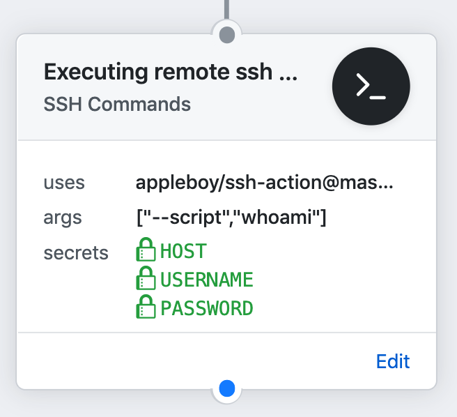
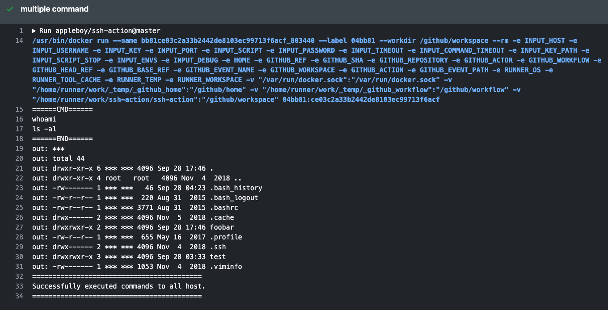

# 🚀 SSH for GitHub Actions

[GitHub Action](https://github.com/features/actions) for executing remote ssh commands.



[](https://github.com/appleboy/ssh-action/actions)

**Important**: Only support **Linux** [docker](https://www.docker.com/) container.

## Input variables

See [action.yml](./action.yml) for more detailed information.

* `host` - ssh host
* `port` - ssh port, default is `22`
* `username` - ssh username
* `password` - ssh password
* `passphrase` - the passphrase is usually to encrypt the private key
* `sync` - synchronous execution if multiple hosts, default is false
* `timeout` - timeout for ssh to remote host, default is `30s`
* `command_timeout` - timeout for ssh command, default is `10m`
* `key` - content of ssh private key. ex raw content of ~/.ssh/id_rsa
* `key_path` - path of ssh private key
* `fingerprint` - fingerprint SHA256 of the host public key, default is to skip verification
* `script` - execute commands
* `script_stop` - stop script after first failure
* `envs` - pass environment variable to shell script
* `debug` - enable debug mode
* `use_insecure_cipher` - include more ciphers with use_insecure_cipher (see [#56](https://github.com/appleboy/ssh-action/issues/56))
* `cipher` - the allowed cipher algorithms. If unspecified then a sensible

SSH Proxy Setting:

* `proxy_host` - proxy host
* `proxy_port` - proxy port, default is `22`
* `proxy_username` - proxy username
* `proxy_password` - proxy password
* `proxy_passphrase` - the passphrase is usually to encrypt the private key
* `proxy_timeout` - timeout for ssh to proxy host, default is `30s`
* `proxy_key` - content of ssh proxy private key.
* `proxy_key_path` - path of ssh proxy private key
* `proxy_fingerprint` - fingerprint SHA256 of the proxy host public key, default is to skip verification
* `proxy_use_insecure_cipher` - include more ciphers with use_insecure_cipher (see [#56](https://github.com/appleboy/ssh-action/issues/56))
* `proxy_cipher` - the allowed cipher algorithms. If unspecified then a sensible

## Usage

Executing remote ssh commands.

```yaml
name: remote ssh command
on: [push]
jobs:

  build:
    name: Build
    runs-on: ubuntu-latest
    steps:
    - name: executing remote ssh commands using password
      uses: appleboy/ssh-action@master
      with:
        host: ${{ secrets.HOST }}
        username: ${{ secrets.USERNAME }}
        password: ${{ secrets.PASSWORD }}
        port: ${{ secrets.PORT }}
        script: whoami
```

output:

```sh
======CMD======
whoami
======END======
out: ***
==============================================
✅ Successfully executed commands to all host.
==============================================
```

### Setting up a SSH Key

Make sure to follow the below steps while creating SSH Keys and using them.
The best practice is create the SSH Keys on local machine not remote machine.
Login with username specified in Github Secrets. Generate a RSA Key-Pair:

<details>
<summary>rsa</summary>
<p>

```bash
ssh-keygen -t rsa -b 4096 -C "your_email@example.com"
```

</p>
</details>

<details>
<summary>ed25519</summary>
<p>

```bash
ssh-keygen -t ed25519 -a 200 -C "your_email@example.com"
```

</p>
</details>

Add newly generated key into Authorized keys. Read more about authorized keys [here](https://www.ssh.com/ssh/authorized_keys/).

<details>
<summary>rsa</summary>
<p>

```bash
cat .ssh/id_rsa.pub | ssh b@B 'cat >> .ssh/authorized_keys'
```

</p>
</details>

<details>
<summary>ed25519</summary>
<p>

```bash
cat .ssh/id_ed25519.pub | ssh b@B 'cat >> .ssh/authorized_keys'
```

</p>
</details>

Copy Private Key content and paste in Github Secrets.

<details>
<summary>rsa</summary>
<p>

```bash
clip < ~/.ssh/id_rsa
```

</p>
</details>

<details>
<summary>ed25519</summary>
<p>

```bash
clip < ~/.ssh/id_ed25519
```

</p>
</details>

See the detail information about [SSH login without password](http://www.linuxproblem.org/art_9.html).

**A note** from one of our readers: Depending on your version of SSH you might also have to do the following changes:

* Put the public key in `.ssh/authorized_keys2`
* Change the permissions of `.ssh` to 700
* Change the permissions of `.ssh/authorized_keys2` to 640

### Example

#### Executing remote ssh commands using password

```yaml
- name: executing remote ssh commands using password
  uses: appleboy/ssh-action@master
  with:
    host: ${{ secrets.HOST }}
    username: ${{ secrets.USERNAME }}
    password: ${{ secrets.PASSWORD }}
    port: ${{ secrets.PORT }}
    script: whoami
```

#### Using private key

```yaml
- name: executing remote ssh commands using ssh key
  uses: appleboy/ssh-action@master
  with:
    host: ${{ secrets.HOST }}
    username: ${{ secrets.USERNAME }}
    key: ${{ secrets.KEY }}
    port: ${{ secrets.PORT }}
    script: whoami
```

#### Multiple Commands

```yaml
- name: multiple command
  uses: appleboy/ssh-action@master
  with:
    host: ${{ secrets.HOST }}
    username: ${{ secrets.USERNAME }}
    key: ${{ secrets.KEY }}
    port: ${{ secrets.PORT }}
    script: |
      whoami
      ls -al
```



#### Multiple Hosts

```diff
  - name: multiple host
    uses: appleboy/ssh-action@master
    with:
-     host: "foo.com"
+     host: "foo.com,bar.com"
      username: ${{ secrets.USERNAME }}
      key: ${{ secrets.KEY }}
      port: ${{ secrets.PORT }}
      script: |
        whoami
        ls -al
```

#### Multiple hosts with different port

```diff
  - name: multiple host
    uses: appleboy/ssh-action@master
    with:
-     host: "foo.com"
+     host: "foo.com:1234,bar.com:5678"
      username: ${{ secrets.USERNAME }}
      key: ${{ secrets.KEY }}
      script: |
        whoami
        ls -al
```

#### Synchronous execution on multiple hosts

```diff
  - name: multiple host
    uses: appleboy/ssh-action@master
    with:
      host: "foo.com,bar.com"
+     sync: true
      username: ${{ secrets.USERNAME }}
      key: ${{ secrets.KEY }}
      port: ${{ secrets.PORT }}
      script: |
        whoami
        ls -al
```

#### Pass environment variable to shell script

```diff
  - name: pass environment
    uses: appleboy/ssh-action@master
+   env:
+     FOO: "BAR"
+     BAR: "FOO"
+     SHA: ${{ github.sha }}
    with:
      host: ${{ secrets.HOST }}
      username: ${{ secrets.USERNAME }}
      key: ${{ secrets.KEY }}
      port: ${{ secrets.PORT }}
+     envs: FOO,BAR
      script: |
        echo "I am $FOO"
        echo "I am $BAR"
        echo "sha: $SHA"
```

_Inside `env` object, you need to pass every environment variable as a string, passing `Integer` data type or any other may output unexpected results._

#### Stop script after first failure

> ex: missing `abc` folder

```diff
  - name: stop script if command error
    uses: appleboy/ssh-action@master
    with:
      host: ${{ secrets.HOST }}
      username: ${{ secrets.USERNAME }}
      key: ${{ secrets.KEY }}
      port: ${{ secrets.PORT }}
+     script_stop: true
      script: |
        mkdir abc/def
        ls -al
```

output:

```sh
======CMD======
mkdir abc/def
ls -al

======END======
2019/11/21 01:16:21 Process exited with status 1
err: mkdir: cannot create directory ‘abc/def’: No such file or directory
##[error]Docker run failed with exit code 1
```

#### How to connect remote server using `ProxyCommand`?

```bash
+--------+       +----------+      +-----------+
| Laptop | <-->  | Jumphost | <--> | FooServer |
+--------+       +----------+      +-----------+
```

in your `~/.ssh/config`, you will see the following.

```bash
Host Jumphost
  HostName Jumphost
  User ubuntu
  Port 22
  IdentityFile ~/.ssh/keys/jump_host.pem

Host FooServer
  HostName FooServer
  User ubuntu
  Port 22
  ProxyCommand ssh -q -W %h:%p Jumphost
```

#### How to convert to YAML format of GitHubActions

```diff
  - name: ssh proxy command
    uses: appleboy/ssh-action@master
    with:
      host: ${{ secrets.HOST }}
      username: ${{ secrets.USERNAME }}
      key: ${{ secrets.KEY }}
      port: ${{ secrets.PORT }}
+     proxy_host: ${{ secrets.PROXY_HOST }}
+     proxy_username: ${{ secrets.PROXY_USERNAME }}
+     proxy_key: ${{ secrets.PROXY_KEY }}
+     proxy_port: ${{ secrets.PROXY_PORT }}
      script: |
        mkdir abc/def
        ls -al
```

#### Protecting a Private Key

The purpose of the passphrase is usually to encrypt the private key.
This makes the key file by itself useless to an attacker. 
It is not uncommon for files to leak from backups or decommissioned hardware, and hackers commonly exfiltrate files from compromised systems.

```diff
  - name: ssh key passphrase
    uses: appleboy/ssh-action@master
    with:
      host: ${{ secrets.HOST }}
      username: ${{ secrets.USERNAME }}
      key: ${{ secrets.KEY }}
      port: ${{ secrets.PORT }}
+     passphrase: ${{ secrets.PASSPHRASE }}
      script: |
        whoami
        ls -al
```

#### Using host fingerprint verification

Setting up SSH host fingerprint verification can help to prevent Person-in-the-Middle attacks. Before setting this up, run the command below to get your SSH host fingerprint. Remember to replace `ed25519` with your appropriate key type (`rsa`, `dsa`, etc.) that your server is using and `example.com` with your host.

In modern OpenSSH releases, the _default_ key types to be fetched are `rsa` (since version 5.1), `ecdsa` (since version 6.0), and `ed25519` (since version 6.7).

```
ssh example.com ssh-keygen -l -f /etc/ssh/ssh_host_ed25519_key.pub | cut -d ' ' -f2
```

Now you can adjust you config:

```diff
  - name: ssh key passphrase
    uses: appleboy/ssh-action@master
    with:
      host: ${{ secrets.HOST }}
      username: ${{ secrets.USERNAME }}
      key: ${{ secrets.KEY }}
      port: ${{ secrets.PORT }}
+     fingerprint: ${{ secrets.FINGERPRINT }}
      script: |
        whoami
        ls -al
```

## Contributing
We would love for you to contribute to `appleboy/ssh-action`, pull requests are welcome!

## License
The scripts and documentation in this project are released under the [MIT License](LICENSE)
